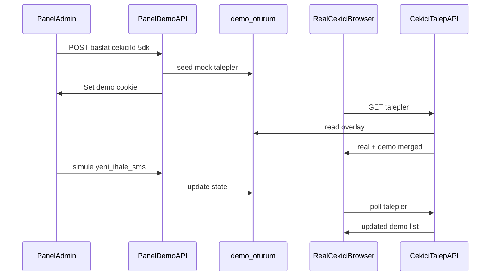

# Video demo modu (izole mock + gerçek hesap)

## Problem

Kayıt için canlı görünüm lazım ama:

- Normal kullanıcılar mock veri görmemeli
- Gerçek Supabase verisi (talepler, kredi, SMS) kirlenmemeli
- Gerçek çekici hesabıyla panelde etkileşim + müşteri bekle ekranı gösterilmeli
- SMS ve ihale olayları butonla simüle edilebilmeli (~5 dk)

## Önerilen mimari: Ephemeral demo overlay

Production tablolarına yazmak yerine `**demo-` prefix’li sahte talep ID’leri** ve `**demo_oturum` tablosunda JSON state** kullanılır. Gerçek çekici oturumu (`cekici_token` cookie) aynen kalır; API’ler demo cookie aktifken DB sonucunun **üzerine** demo verisini merge eder.




**Neden DB overlay (in-memory değil)?** Vercel serverless’ta bellek paylaşılmaz; tek migration + JSONB güvenilir. Production `talepler` / `cekiciler` satırlarına dokunulmaz.

## Güvenlik ve izolasyon


| Kural         | Uygulama                                                                                             |
| ------------- | ---------------------------------------------------------------------------------------------------- |
| Kim başlatır? | Yalnızca panel admin (`[middleware.ts](middleware.ts)` korumalı `/api/panel/demo/`*)                 |
| Kim görür?    | `acil_demo` httpOnly cookie olan tarayıcı (panelden başlatıldıktan sonra aynı cihazda çekici girişi) |
| Süre          | `bitis` timestamp; her okumada expire → cookie sil, satır sil                                        |
| Kill switch   | `DEMO_MODE_ENABLED=true` env (prod’da kapalı tutulabilir)                                            |
| Gerçek veri   | Demo talep ID’leri `demo-`*; `getTalepById` demo branch’inde DB’ye gitmez                            |
| Kredi / SMS   | Demo `katil` / `teklif` / `notify`* **no-op** veya sadece demo store + demo SMS listesi              |


## Veri modeli

Yeni migration: `[supabase/migrations/016_demo_oturum.sql](supabase/migrations/016_demo_oturum.sql)`

```sql
demo_oturum (
  id uuid PK,
  cekici_id text NOT NULL,
  bitis timestamptz NOT NULL,
  durum jsonb NOT NULL,  -- talepler[], sms[], musteriTalepId, senaryo
  olusturan text
)
```

Fixture’lar: `[src/lib/demo-fixtures.ts](src/lib/demo-fixtures.ts)` — 2–3 İstanbul ihaleleri (açık/gizli), rakip teklifler, müşteri adı/konum/sorun metinleri. Mevcut `[src/lib/seed.ts](src/lib/seed.ts)` demo çekicilerine dokunulmaz.

Core modül: `[src/lib/demo-oturum.ts](src/lib/demo-oturum.ts)`

- `baslatDemoOturum(cekiciId, sureDk)`
- `getAktifDemoOturum(cookieId)`
- `demoTalepGetir / demoTalepGuncelle`
- `mergeCekiciPanelData(realData, demoState, cekiciId)`
- `isDemoTalepId(id) => id.startsWith('demo-')`

## API yüzeyi

**Panel kontrol (yeni)** — `[src/app/panel/demo/page.tsx](src/app/panel/demo/page.tsx)`

- Nav: `[PanelNav.tsx](src/components/PanelNav.tsx)`, mobil `[PanelChrome.tsx](src/components/PanelChrome.tsx)`


| Endpoint                      | İşlev                                      |
| ----------------------------- | ------------------------------------------ |
| `POST /api/panel/demo/baslat` | `{ cekiciId, sureDk?: 5 }` → cookie + seed |
| `POST /api/panel/demo/durdur` | Oturumu sil                                |
| `GET /api/panel/demo/durum`   | Kalan süre, bağlı çekici, müşteri linki    |
| `POST /api/panel/demo/simule` | `{ olay }` — aşağıdaki olaylar             |


**Simülasyon olayları (panel butonları):**

1. `yeni_ihale_gizli` — çekici panelinde kilitli ihale + demo SMS kutusuna kayıt
2. `ihaleyi_ac` — bildirilen çekici listesine ekle (açık ihale)
3. `rakip_teklif` — müşteri bekle ekranına rakip teklif
4. `benim_teklifim` — demo talebe sizin teklifiniz (gerçek ad/rozet)
5. `musteri_secti` — kazanan = bu çekici
6. `musteri_yeni_teklif_sms` — demo müşteri SMS satırı

**Çekici API overlay** (demo branch, DB write yok):

- `[src/app/api/cekici/talepler/route.ts](src/app/api/cekici/talepler/route.ts)` — merge lists
- `[src/app/api/cekici/talep/[id]/route.ts](src/app/api/cekici/talep/[id]/route.ts)`
- `[src/app/api/cekici/talep/[id]/katil/route.ts](src/app/api/cekici/talep/[id]/katil/route.ts)` — kredi düşme yok
- `[src/app/api/cekici/talep/[id]/teklif/route.ts](src/app/api/cekici/talep/[id]/teklif/route.ts)` — demo store’a yaz

**Müşteri tarafı overlay:**

- `[src/app/api/talep/[id]/route.ts](src/app/api/talep/[id]/route.ts)` — bekle polling
- `[src/app/api/talep/[id]/teklif-sec/route.ts](src/app/api/talep/[id]/teklif-sec/route.ts)` — demo seçim (opsiyonel; panel simülasyonu yeterli olabilir)

Panel demo sayfasında **“Müşteri ekranını aç”** linki: `/bekle/{demoTalepId}` (yeni sekme).

## UI değişiklikleri

1. **Panel `/panel/demo`**
  - Çekici seç (dropdown: `[GET /api/panel/cekiciler](src/app/api/panel/cekiciler/route.ts)`)
  - “Demo başlat (5 dk)” / “Durdur”
  - Geri sayım
  - Simülasyon butonları + son SMS listesi (mevcut `[/demo/sms](src/app/demo/sms/page.tsx)` mantığı genişletilebilir veya panel içi embed)
2. **Çekici panel banner** — `[CekiciPanelTabs.tsx](src/components/CekiciPanelTabs.tsx)`
  - Demo aktifken üstte amber şerit: “Demo modu — gerçek veri değişmiyor”
  - `GET /api/cekici/demo-durum` (hafif, cookie check)
3. **Müşteri bekle** — `[bekle/[id]/page.tsx](src/app/bekle/[id]/page.tsx)`
  - Demo talep ID’sinde normal polling çalışır; API demo state döner
  - İsteğe bağlı küçük “Demo” etiketi (sadece demo ID’de)

## Kayıt akışı önerisi (video senaryosu)

1. Panel → Demo başlat → kendi çekici hesabınızı seçin
2. Aynı tarayıcıda `/cekici/giris` (gerçek hesap)
3. İhaleler sekmesinde mock ihaleler görünür
4. Panelden “SMS simüle” / “İhale aç”
5. Çekici panelinde katıl → teklif ver (kredi düşmez)
6. Panelden “Müşteri ekranını aç” → teklifler listelenir
7. Panelden “Müşteri seçti” → çekici tarafında Kazandıklarım
8. Süre dolunca veya “Durdur” → her şey kaybolur, prod veri aynı

## Mevcut kodla ilişki

- `[src/app/demo/sms/page.tsx](src/app/demo/sms/page.tsx)`: Gerçek `sms_log` okur; demo modda **ayrı demo SMS dizisi** panelden gösterilir (prod log karışmaz). İsteğe bağlı: demo aktifken bu sayfaya filtre.
- `[KayitKontenjanBilgi](src/components/KayitKontenjanBilgi.tsx)` `?onizleme=` sadece dev — video için demo oturumu daha güvenli.

## Test planı

- Unit: `demo-oturum.test.ts` — merge, expire, `isDemoTalepId`
- Manuel: demo başlat → çekici listesinde mock ihale → teklif → DB’de `talepler` count değişmediğini doğrula → kredi aynı → süre bitince liste temiz

## Kapsam dışı (ilk PR)

- Ana sayfadan otomatik demo talep oluşturma (panel linki yeterli)
- Çoklu eşzamanlı demo oturumu (tek aktif oturum / admin başına yeterli)
- Redis (ileride trafik artarsa)

## Uygulama sırası

1. Migration + `demo-oturum.ts` + fixtures
2. Panel demo API + `/panel/demo` UI
3. Çekici talep API overlay + banner
4. Müşteri `talep/[id]` overlay + panel link
5. Testler + kısa `docs/video-demo.md` kullanım notu

